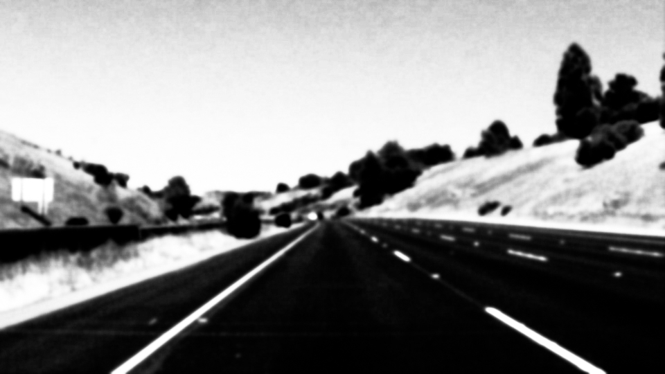

#**Finding Lane Lines on the Road** 

---

**Finding Lane Lines on the Road**

The goals / steps of this project are the following:
* Make a pipeline that finds lane lines on the road
* Reflect on your work in a written report

[//]: # (Image References)

[image1]: ./examples/grayscale.jpg "Grayscale"
[image2]: ./examples/1.jpg "highcontrast"

---

### Reflection

###1. Describe your pipeline. As part of the description, explain how you modified the draw_lines() function.

My pipeline consisted of 5 steps. First, I converted the images to grayscale, then I apply a Gaussian Blurer to the image. After that I use the canny edge detection algorithem and calibrate the parameters(low_threshold and high_threshold). Next I apply an image mask to select the region of tnterest. Then I use Hough transform algorithm to draw lines in the edges. The parameters of hough transform is a little bit tricky to calibrate. 

In order to draw a single line on the left and right lanes, I modified the draw_lines() function by separate the line segments between their slope. And for each side of the lines. I average the position of each of the lines and extend it to reasonable length.

###2. Identify potential shortcomings with your current pipeline

One potential shortcoming would be what would happen when the light conditions change or some dirty texture on the roads. The hough transform algorithm will not work that well in such cases. Even in one video this pipeline would not working well in some of the frams. In fact I need to calibrate the parameters of Hough transform for every single videos.

In another words, this pipeline need too much parameters to calibrate and each group of parameters only work on very few amounts of conditions. So it is not robust at all.

When I running the Optional Challenge ｍy pipeline is completely busted. To make it work I need to change almost every single parameters then not working on previous 2 videos.

###3. Suggest possible improvements to your pipeline

A possible improvement would be to increase the contrast of the image after applying a Gaussian Blurer. Because the lane line is always bright and the noise is in dark. just like the image below that I change it using photoshop. This approach will make the pipeline a little bit robust.
